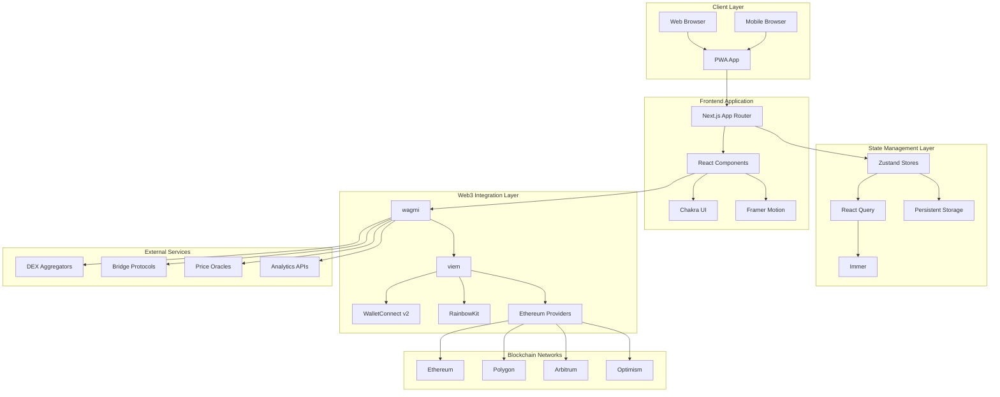
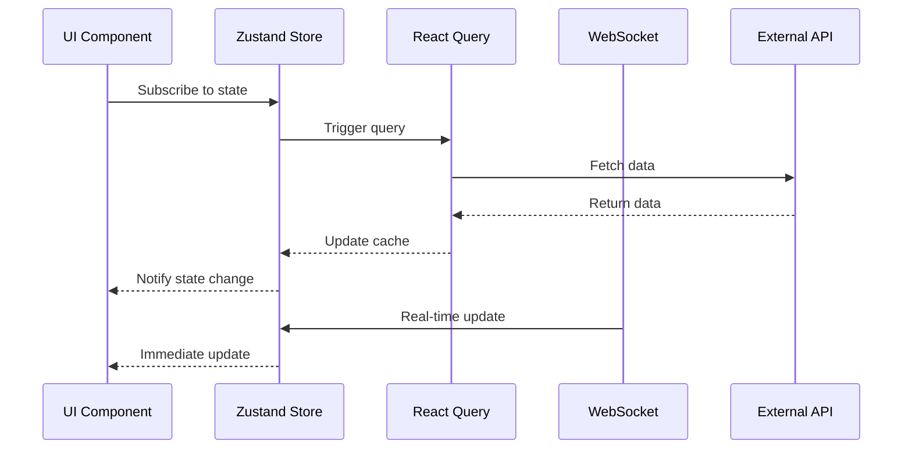
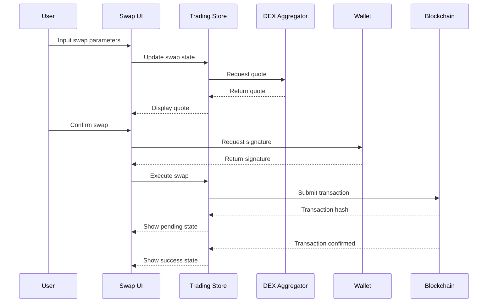

# ChainBridge DEX - システムアーキテクチャ

## 🏗️ 全体アーキテクチャ

### システム構成図


## 🎯 アーキテクチャ原則

### 1. モジュラー設計
- **関心の分離**: 各レイヤーは明確な責任を持つ
- **疎結合**: コンポーネント間の依存関係を最小化
- **高凝集**: 関連する機能を同じモジュールに配置
- **再利用性**: コンポーネントとサービスの再利用を促進

### 2. スケーラビリティ
- **水平スケーリング**: 負荷分散とCDN活用
- **コード分割**: 動的インポートによる最適化
- **キャッシュ戦略**: 多層キャッシュシステム
- **非同期処理**: パフォーマンス最適化

### 3. 保守性
- **型安全性**: TypeScriptによる静的型チェック
- **テスタビリティ**: 単体・統合・E2Eテスト
- **ドキュメント**: 包括的なドキュメント
- **監視**: エラー追跡とパフォーマンス監視

## 📱 フロントエンドアーキテクチャ

### レイヤー構成
```typescript
// Presentation Layer (UI Components)
├── Pages/Routes          // Next.js App Router
├── Components           // React Components
├── Layouts             // Layout Components
└── Themes              // Chakra UI Themes

// Business Logic Layer
├── Hooks               // Custom React Hooks
├── Services            // External Service Integration
├── Utils               // Utility Functions
└── Validators          // Input Validation

// Data Layer
├── Stores              // Zustand State Management
├── Queries             // React Query Configurations
├── Types               // TypeScript Definitions
└── Constants           // Application Constants

// Infrastructure Layer
├── Config              // Environment Configuration
├── Providers           // Context Providers
├── Middleware          // Request/Response Middleware
└── Error Handling      // Global Error Management
```

### コンポーネント設計パターン
```typescript
// Container/Presenter Pattern
interface ContainerProps {
  // Business logic props
}

interface PresenterProps {
  // UI-only props
  data: any
  loading: boolean
  error: Error | null
  onAction: (data: any) => void
}

// Compound Component Pattern
const SwapInterface = {
  Container: SwapContainer,
  TokenSelector: TokenSelector,
  AmountInput: AmountInput,
  SwapButton: SwapButton,
  Settings: SwapSettings,
}

// Render Props Pattern
interface DataProviderProps {
  children: (data: DataState) => React.ReactNode
}

// Custom Hook Pattern
function useSwapLogic() {
  // Business logic
  return {
    state,
    actions,
    selectors,
  }
}
```

## 🔄 状態管理アーキテクチャ

### Zustand Store 設計
```typescript
// Store Slice Pattern
interface StoreSlice<T> {
  // State
  [key: string]: T
  
  // Actions
  actions: {
    [actionName: string]: (...args: any[]) => void
  }
  
  // Selectors
  selectors: {
    [selectorName: string]: (state: T) => any
  }
}

// Store Composition
interface RootStore extends
  TradingSlice,
  PoolSlice,
  PortfolioSlice,
  UISlice,
  ConnectionSlice {
  // Global actions
  reset: () => void
  hydrate: (state: Partial<RootStore>) => void
}
```

### React Query 統合
```typescript
// Query Configuration
interface QueryConfig {
  // Cache strategy
  staleTime: number
  cacheTime: number
  
  // Retry strategy
  retry: boolean | number
  retryDelay: (attemptIndex: number) => number
  
  // Background updates
  refetchOnWindowFocus: boolean
  refetchOnReconnect: boolean
  refetchInterval: number | false
}

// Mutation Configuration
interface MutationConfig {
  // Optimistic updates
  onMutate: (variables: any) => Promise<any>
  
  // Success handling
  onSuccess: (data: any, variables: any, context: any) => void
  
  // Error handling
  onError: (error: any, variables: any, context: any) => void
  
  // Cleanup
  onSettled: (data: any, error: any, variables: any, context: any) => void
}
```

## 🌐 Web3 アーキテクチャ

### 接続管理
```typescript
// Wallet Connection Architecture
interface WalletManager {
  // Connection state
  isConnected: boolean
  address?: string
  chainId?: number
  
  // Connection methods
  connect: (connector: Connector) => Promise<void>
  disconnect: () => Promise<void>
  switchChain: (chainId: number) => Promise<void>
  
  // Event handlers
  onConnect: (handler: (data: ConnectionData) => void) => void
  onDisconnect: (handler: () => void) => void
  onChainChanged: (handler: (chainId: number) => void) => void
}

// Multi-Chain Support
interface ChainManager {
  // Supported chains
  supportedChains: Chain[]
  
  // Current chain
  currentChain: Chain
  
  // Chain operations
  switchToChain: (chainId: number) => Promise<void>
  addChain: (chain: Chain) => Promise<void>
  
  // Chain-specific providers
  getProvider: (chainId: number) => Provider
  getContract: (address: string, abi: Abi, chainId: number) => Contract
}
```

### トランザクション管理
```typescript
// Transaction Lifecycle
interface TransactionManager {
  // Transaction states
  pending: Transaction[]
  confirmed: Transaction[]
  failed: Transaction[]
  
  // Transaction operations
  submit: (tx: TransactionRequest) => Promise<string>
  track: (hash: string) => Promise<TransactionReceipt>
  retry: (hash: string) => Promise<string>
  cancel: (hash: string) => Promise<void>
  
  // Event handlers
  onSubmitted: (handler: (tx: Transaction) => void) => void
  onConfirmed: (handler: (tx: Transaction) => void) => void
  onFailed: (handler: (tx: Transaction) => void) => void
}
```

## 🔌 外部サービス統合

### DEX Aggregator 統合
```typescript
// Aggregator Interface
interface DEXAggregator {
  name: string
  
  // Quote methods
  getQuote: (params: QuoteParams) => Promise<Quote>
  getSwapData: (quote: Quote) => Promise<SwapData>
  
  // Supported features
  supportedChains: number[]
  supportedTokens: string[]
  
  // Configuration
  config: AggregatorConfig
}

// Multi-Aggregator Strategy
class AggregatorManager {
  private aggregators: DEXAggregator[]
  
  async getBestQuote(params: QuoteParams): Promise<Quote> {
    const quotes = await Promise.allSettled(
      this.aggregators.map(agg => agg.getQuote(params))
    )
    
    return this.selectBestQuote(quotes)
  }
}
```

### Bridge Protocol 統合
```typescript
// Bridge Interface
interface BridgeProtocol {
  name: string
  
  // Bridge methods
  getQuote: (params: BridgeParams) => Promise<BridgeQuote>
  executeBridge: (quote: BridgeQuote) => Promise<BridgeTransaction>
  trackBridge: (id: string) => Promise<BridgeStatus>
  
  // Supported routes
  supportedRoutes: BridgeRoute[]
  
  // Configuration
  config: BridgeConfig
}
```

## 📊 データフロー

### リアルタイムデータフロー


### 取引フロー


## 🔧 開発・デプロイメントアーキテクチャ

### 開発環境
```typescript
// Development Stack
{
  "runtime": "Node.js 20+",
  "framework": "Next.js 15",
  "language": "TypeScript 5.3+",
  "packageManager": "npm",
  "bundler": "Webpack 5 (Next.js)",
  "devServer": "Next.js Dev Server",
  "hotReload": "Fast Refresh"
}
```

### ビルド・デプロイメント
```typescript
// Build Pipeline
{
  "stages": [
    "Lint & Type Check",
    "Unit Tests",
    "Build Application",
    "Integration Tests",
    "E2E Tests",
    "Security Scan",
    "Performance Audit",
    "Deploy to Staging",
    "Smoke Tests",
    "Deploy to Production"
  ]
}

// Deployment Strategy
{
  "strategy": "Blue-Green Deployment",
  "rollback": "Automatic on failure",
  "monitoring": "Real-time health checks",
  "scaling": "Auto-scaling based on load"
}
```

## 🔐 セキュリティアーキテクチャ

### 多層防御
```typescript
// Security Layers
{
  "network": {
    "cdn": "Cloudflare with DDoS protection",
    "firewall": "Web Application Firewall",
    "ssl": "TLS 1.3 encryption"
  },
  
  "application": {
    "csp": "Content Security Policy",
    "cors": "Cross-Origin Resource Sharing",
    "headers": "Security headers (HSTS, etc.)"
  },
  
  "web3": {
    "walletSecurity": "Hardware wallet support",
    "transactionValidation": "Multi-layer validation",
    "contractVerification": "Verified contracts only"
  }
}
```

## 📈 監視・運用アーキテクチャ

### 監視スタック
```typescript
// Monitoring Architecture
{
  "performance": {
    "metrics": "Core Web Vitals",
    "apm": "Application Performance Monitoring",
    "rum": "Real User Monitoring"
  },
  
  "errors": {
    "tracking": "Error tracking service",
    "alerting": "Real-time alerts",
    "debugging": "Source map support"
  },
  
  "business": {
    "analytics": "User behavior tracking",
    "conversion": "Funnel analysis",
    "retention": "User retention metrics"
  }
}
```

---

**Document Version**: 1.0.0  
**Last Updated**: 2024年12月  
**Next Review**: 2025年1月
