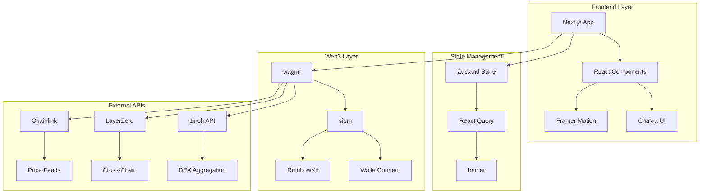

# ChainBridge DEX - 技術仕様書

## 🏗️ システムアーキテクチャ

### 全体構成図


### 技術スタック詳細

#### フロントエンド Core
```typescript
// Package.json dependencies
{
  "next": "^15.0.0",
  "react": "^18.0.0",
  "typescript": "^5.3.0",
  "@chakra-ui/react": "^3.0.0",
  "framer-motion": "^11.0.0",
  "zustand": "^4.4.0",
  "@tanstack/react-query": "^5.0.0"
}
```

#### Web3 Integration
```typescript
// Web3 Stack
{
  "wagmi": "^2.0.0",
  "viem": "^2.0.0",
  "@rainbow-me/rainbowkit": "^2.0.0",
  "@walletconnect/web3wallet": "^1.0.0"
}
```

#### Development Tools
```typescript
// Development Dependencies
{
  "eslint": "^8.0.0",
  "prettier": "^3.0.0",
  "vitest": "^1.0.0",
  "@testing-library/react": "^14.0.0",
  "playwright": "^1.40.0",
  "@storybook/react": "^7.0.0"
}
```

## 📁 プロジェクト構造

```
src/
├── app/                    # Next.js App Router
│   ├── (dashboard)/       # Dashboard routes
│   ├── swap/              # Swap functionality
│   ├── pools/             # Liquidity pools
│   ├── portfolio/         # Portfolio management
│   └── analytics/         # Analytics dashboard
├── components/            # React components
│   ├── UI/               # Base UI components
│   ├── Layout/           # Layout components
│   ├── Swap/             # Swap-specific components
│   ├── Pools/            # Pool-specific components
│   ├── Charts/           # Chart components
│   └── Navigation/       # Navigation components
├── hooks/                # Custom React hooks
│   ├── useAnimations.ts  # Animation hooks
│   ├── useMobile.ts      # Mobile-specific hooks
│   ├── useRealtime.ts    # Real-time data hooks
│   └── useWeb3.ts        # Web3 interaction hooks
├── services/             # External service integrations
│   ├── dex/              # DEX aggregator services
│   ├── bridge/           # Cross-chain bridge services
│   ├── oracle/           # Price oracle services
│   ├── websocket/        # WebSocket management
│   └── realtime/         # Real-time data services
├── store/                # State management
│   ├── advanced/         # Advanced Zustand stores
│   ├── slices/           # Store slices
│   └── types.ts          # Store type definitions
├── theme/                # Chakra UI theme
│   ├── index.ts          # Main theme
│   ├── components.ts     # Component themes
│   └── advanced.ts       # Advanced theme features
├── utils/                # Utility functions
│   ├── web3.ts           # Web3 utilities
│   ├── format.ts         # Formatting utilities
│   └── validation.ts     # Validation utilities
├── config/               # Configuration files
│   ├── chains.ts         # Blockchain configurations
│   ├── tokens.ts         # Token configurations
│   └── constants.ts      # Application constants
└── types/                # TypeScript type definitions
    ├── web3.ts           # Web3 types
    ├── api.ts            # API types
    └── global.ts         # Global types
```

## 🔧 コンポーネント設計

### 設計原則
1. **Single Responsibility**: 各コンポーネントは単一の責任を持つ
2. **Composition over Inheritance**: 継承よりも合成を優先
3. **Props Interface**: 明確なProps型定義
4. **Accessibility First**: アクセシビリティを最優先
5. **Performance Optimized**: React.memo、useMemo、useCallbackの適切な使用

### コンポーネント階層
```typescript
// Base UI Components
interface BaseComponentProps {
  children?: React.ReactNode
  className?: string
  'data-testid'?: string
}

// Enhanced UI Components
interface EnhancedComponentProps extends BaseComponentProps {
  animation?: AnimationType
  hapticFeedback?: boolean
  accessibility?: AccessibilityProps
}

// Feature Components
interface FeatureComponentProps extends EnhancedComponentProps {
  onAction?: (data: any) => void
  loading?: boolean
  error?: Error | null
}
```

### 状態管理パターン
```typescript
// Zustand Store Pattern
interface StoreSlice<T> {
  // State
  state: T
  
  // Actions
  actions: {
    update: (partial: Partial<T>) => void
    reset: () => void
    [key: string]: (...args: any[]) => any
  }
  
  // Selectors
  selectors: {
    [key: string]: (state: T) => any
  }
}

// React Query Pattern
interface QueryConfig<TData, TError = Error> {
  queryKey: string[]
  queryFn: () => Promise<TData>
  staleTime?: number
  cacheTime?: number
  retry?: boolean | number
  onSuccess?: (data: TData) => void
  onError?: (error: TError) => void
}
```

## 🌐 Web3 Integration

### ウォレット接続
```typescript
// Wallet Configuration
const walletConfig = {
  chains: [mainnet, polygon, arbitrum, optimism],
  transports: {
    [mainnet.id]: http(),
    [polygon.id]: http(),
    [arbitrum.id]: http(),
    [optimism.id]: http(),
  },
  connectors: [
    injected(),
    walletConnect({ projectId }),
    coinbaseWallet({ appName: 'ChainBridge DEX' }),
  ],
}

// Wallet Provider Setup
function WalletProvider({ children }: { children: React.ReactNode }) {
  return (
    <WagmiProvider config={config}>
      <QueryClientProvider client={queryClient}>
        <RainbowKitProvider>
          {children}
        </RainbowKitProvider>
      </QueryClientProvider>
    </WagmiProvider>
  )
}
```

### スマートコントラクト統合
```typescript
// Contract Interaction Pattern
interface ContractConfig {
  address: `0x${string}`
  abi: Abi
  chainId: number
}

// Hook Pattern for Contract Calls
function useContractCall<T>(
  config: ContractConfig,
  functionName: string,
  args?: any[]
) {
  return useContractRead({
    ...config,
    functionName,
    args,
    watch: true,
    cacheTime: 30_000,
  })
}

// Transaction Pattern
function useContractWrite<T>(
  config: ContractConfig,
  functionName: string
) {
  return useContractWrite({
    ...config,
    functionName,
    onSuccess: (data) => {
      // Handle success
    },
    onError: (error) => {
      // Handle error
    },
  })
}
```

## 📊 データフロー

### リアルタイムデータ管理
```typescript
// WebSocket Data Flow
WebSocket Connection
  ↓
Price Updates → Zustand Store → React Components
  ↓
UI Updates with Framer Motion Animations

// React Query Cache Strategy
API Call → React Query Cache → Zustand Store → Components
     ↓
Background Refetch → Cache Update → UI Update
```

### 状態同期パターン
```typescript
// Store Synchronization
interface StoreSyncConfig {
  // Local state (Zustand)
  localStore: StoreApi<any>
  
  // Server state (React Query)
  serverQueries: QueryKey[]
  
  // Real-time updates (WebSocket)
  realtimeChannels: string[]
  
  // Sync strategy
  syncStrategy: 'optimistic' | 'pessimistic' | 'hybrid'
}
```

## 🎨 UI/UX 技術仕様

### デザインシステム
```typescript
// Theme Configuration
interface ThemeConfig {
  colors: {
    primary: ColorScale
    secondary: ColorScale
    success: ColorScale
    warning: ColorScale
    error: ColorScale
    neutral: ColorScale
  }
  
  typography: {
    fonts: FontFamily
    fontSizes: FontSizeScale
    fontWeights: FontWeightScale
    lineHeights: LineHeightScale
  }
  
  spacing: SpacingScale
  breakpoints: BreakpointScale
  shadows: ShadowScale
  radii: RadiusScale
}
```

### アニメーション仕様
```typescript
// Animation Configuration
interface AnimationConfig {
  // Transition timing
  duration: {
    fast: 150,
    normal: 300,
    slow: 500,
  }
  
  // Easing functions
  easing: {
    easeOut: [0.4, 0, 0.2, 1],
    easeIn: [0.4, 0, 1, 1],
    easeInOut: [0.4, 0, 0.2, 1],
  }
  
  // Animation variants
  variants: {
    fadeIn: MotionVariants
    slideUp: MotionVariants
    scale: MotionVariants
    stagger: MotionVariants
  }
}
```

### レスポンシブデザイン
```typescript
// Breakpoint System
const breakpoints = {
  base: '0px',    // Mobile first
  sm: '480px',    // Small mobile
  md: '768px',    // Tablet
  lg: '1024px',   // Desktop
  xl: '1280px',   // Large desktop
  '2xl': '1536px' // Extra large
}

// Responsive Utilities
interface ResponsiveValue<T> {
  base?: T
  sm?: T
  md?: T
  lg?: T
  xl?: T
  '2xl'?: T
}
```

## 🔐 セキュリティ実装

### フロントエンドセキュリティ
```typescript
// Content Security Policy
const cspConfig = {
  'default-src': ["'self'"],
  'script-src': ["'self'", "'unsafe-inline'", 'https://trusted-cdn.com'],
  'style-src': ["'self'", "'unsafe-inline'"],
  'img-src': ["'self'", 'data:', 'https:'],
  'connect-src': ["'self'", 'wss:', 'https:'],
}

// Input Validation
interface ValidationSchema {
  address: (value: string) => boolean
  amount: (value: string) => boolean
  slippage: (value: number) => boolean
}
```

### Web3セキュリティ
```typescript
// Transaction Security
interface TransactionSecurity {
  // Signature verification
  verifySignature: (signature: string, message: string) => boolean
  
  // Amount validation
  validateAmount: (amount: bigint, balance: bigint) => boolean
  
  // Contract verification
  verifyContract: (address: string) => Promise<boolean>
  
  // Slippage protection
  calculateMinOutput: (amount: bigint, slippage: number) => bigint
}
```

## 📈 パフォーマンス最適化

### コード分割戦略
```typescript
// Route-based splitting
const SwapPage = lazy(() => import('./pages/SwapPage'))
const PoolsPage = lazy(() => import('./pages/PoolsPage'))
const PortfolioPage = lazy(() => import('./pages/PortfolioPage'))

// Component-based splitting
const TradingChart = lazy(() => import('./components/Charts/TradingChart'))
const AdvancedSettings = lazy(() => import('./components/Settings/AdvancedSettings'))
```

### キャッシュ戦略
```typescript
// React Query Cache Configuration
const queryClient = new QueryClient({
  defaultOptions: {
    queries: {
      staleTime: 5 * 60 * 1000,  // 5 minutes
      cacheTime: 10 * 60 * 1000, // 10 minutes
      retry: 3,
      retryDelay: attemptIndex => Math.min(1000 * 2 ** attemptIndex, 30000),
    },
  },
})
```

### バンドル最適化
```typescript
// Next.js Configuration
const nextConfig = {
  experimental: {
    optimizeCss: true,
    optimizePackageImports: ['@chakra-ui/react', 'framer-motion'],
  },
  
  webpack: (config) => {
    config.optimization.splitChunks = {
      chunks: 'all',
      cacheGroups: {
        vendor: {
          test: /[\\/]node_modules[\\/]/,
          name: 'vendors',
          chunks: 'all',
        },
        web3: {
          test: /[\\/]node_modules[\\/](wagmi|viem|@rainbow-me)[\\/]/,
          name: 'web3',
          chunks: 'all',
        },
      },
    }
    return config
  },
}
```

---

**Document Version**: 1.0.0  
**Last Updated**: 2024年12月  
**Next Review**: 2025年1月
